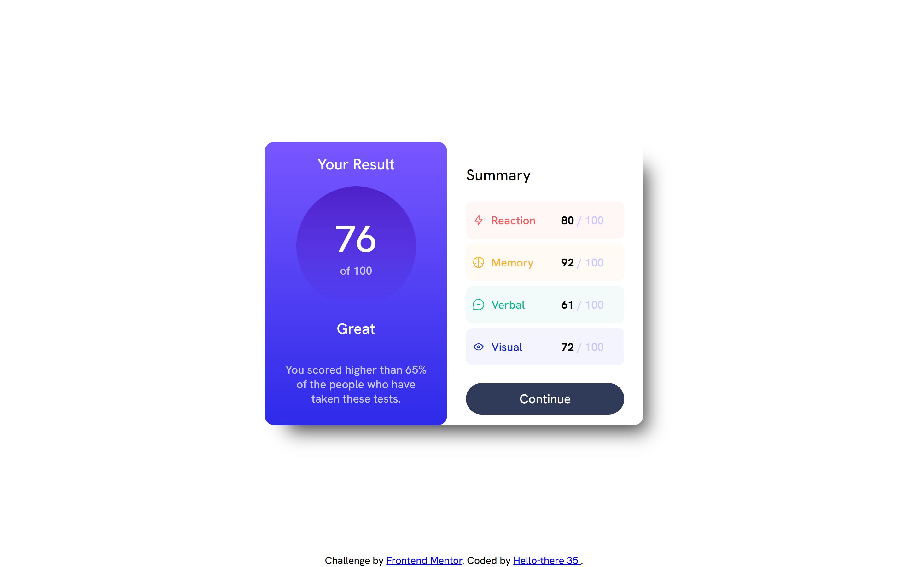

# Frontend Mentor - Results summary component solution

This is a solution to the [Results summary component challenge on Frontend Mentor](https://www.frontendmentor.io/challenges/results-summary-component-CE_K6s0maV). Frontend Mentor challenges help you improve your coding skills by building realistic projects. 

## Table of contents

- [Overview](#overview)
  - [The challenge](#the-challenge)
  - [Screenshot](#screenshot)
  - [Links](#links)
- [My process](#my-process)
  - [Built with](#built-with)
  - [What I learned](#what-i-learned)
  - [Continued development](#continued-development)
  - [Useful resources](#useful-resources)
- [Author](#author)
- [Acknowledgments](#acknowledgments)

## Overview

### The challenge

Users should be able to:

- View the optimal layout for the interface depending on their device's screen size
- See hover and focus states for all interactive elements on the page
- **Bonus**: Use the local JSON data to dynamically populate the content

### Screenshots

## Desktop

## Desktop active state

## Mobile
<div class="center"></div>

### Links

- Solution URL: [Add solution URL here](https://your-solution-url.com)
- Live Site URL: [Add live site URL here](https://your-live-site-url.com)

## My process

### Built with

- Semantic HTML5 markup
- CSS custom properties
- Flexbox
- Vanilla Javascript
- JSON

### What I learned

I learnt how to incorporate animations into websites, I learnt how to parse JSON data to a JS file and I also used scss variables for the first time even though they are just very basic variables and lastly I learned how to import and use a variable font. I am proud of the code below because it takes the data from the JSON file and displays each result on screen. 

```js
import results from '../data.json' assert {type: 'json'};
let getResults = results
let resultSide = document.getElementById("result-side");
for (let i = 0; i < getResults.length; i++) {
    resultSide.innerHTML += `
    <div class="sub-result-container" style="background-color:${getResults[i].backgroundColour}">
    <div class="result-left">
    
    <p class="sub-result-text" style="color:${getResults[i].colour}">
      ${getResults[i].category}
    </p>
  </div>
  <div class="result-right">
    <p class="result">
      <span class="result-highlight">${getResults[i].score} </span>/ 100
    </p>
    </div>
  </div>
  </div>`;
  
}
resultSide.innerHTML += '<button class="continue-button">Continue</button>'
```
### Continued development

I want to somehow make that when scaling the size of the screen the size of the fonts decrease as it goes down to make it more responsive. I would like to include and use more animations in my future projects. I am also thinking of adding jquery to my next projects to make it more interactive. I may also be looking at using bootstrap, tailwind css or other css frameworks to improve my workflow

**Note: Delete this note and the content within this section and replace with your own plans for continued development.**

### Useful resources

- [W3schools](https://www.w3schools.com/css/css3_animations.asp) - Helped with animations
- [freeCodeCamp](https://www.freecodecamp.org/news/how-to-read-json-file-in-javascript/) - This helped me understand how to read/ parse data from a JSON file to Javascript file


## Author


- Frontend Mentor - [@Hello-there 35](https://www.frontendmentor.io/profile/yourusername)


## Acknowledgments

Thanks to Frontend Mentor for creating this challenge.

